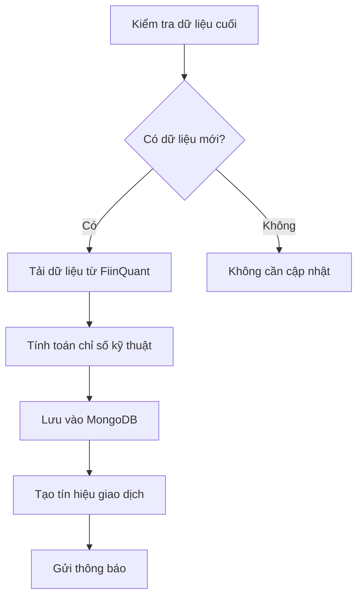
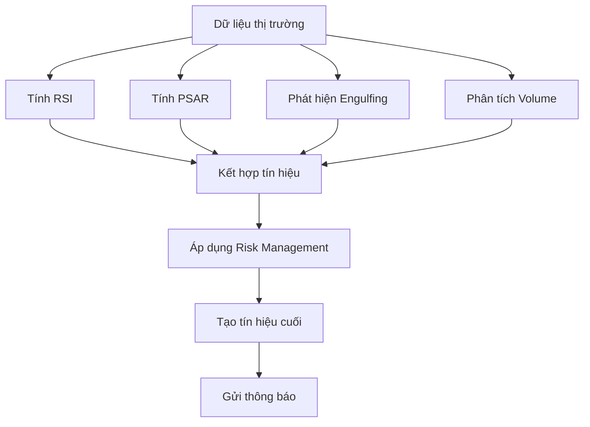

# VITAS Trading System API

Hệ thống giao dịch tự động với phân tích kỹ thuật AI-powered, tích hợp FiinQuant API và thông báo real-time.

## 🚀 Tính năng chính

- **Real-time Data**: Lấy dữ liệu thị trường real-time từ FiinQuant API
- **Technical Analysis**: Tính toán các chỉ số kỹ thuật (RSI, PSAR, Engulfing patterns)
- **Trading Signals**: Tự động tạo tín hiệu mua/bán dựa trên chiến lược RSI-PSAR-Engulfing
- **Risk Management**: Quản lý rủi ro và kích thước vị thế thông minh
- **Notifications**: Gửi cảnh báo qua Telegram và Email
- **Incremental Processing**: Xử lý dữ liệu tăng dần, chỉ tải dữ liệu mới
- **Portfolio Tracking**: Theo dõi hiệu suất danh mục đầu tư

## 🏗️ Kiến trúc hệ thống

```
┌─────────────────┐    ┌─────────────────┐    ┌─────────────────┐
│   Frontend      │    │   NestJS API    │    │   Python Service│
│   (React/Vue)   │◄──►│   (TypeScript)  │◄──►│   (FiinQuant    │
└─────────────────┘    └─────────────────┘    │    Library)     │
                              │                └─────────────────┘
                              ▼
                       ┌─────────────────┐
                       │   MongoDB       │
                       │   (Data Store)  │
                       └─────────────────┘
```

### 🔄 Data Flow với FiinQuantX Library

1. **TypeScript Service** gọi Python script
2. **Python Service** sử dụng FiinQuantX library để fetch data
3. **FiinQuantX Library** kết nối trực tiếp với FiinQuant API
4. **Data** được xử lý và trả về TypeScript service
5. **TypeScript** lưu data vào MongoDB và tạo trading signals

## 📋 Yêu cầu hệ thống

- Node.js 18+
- MongoDB 4.4+
- Redis 6+
- Python 3.8+
- FiinQuantX Python Library
- npm/yarn

## 🛠️ Cài đặt

### 1. Clone repository
```bash
git clone <repository-url>
cd vitas-be
```

### 2. Cài đặt dependencies
```bash
npm install
```

### 3. Cài đặt Python Virtual Environment và FiinQuantX
```bash
cd python-services
python3 -m venv venv
source venv/bin/activate  # Linux/macOS
# hoặc venv\Scripts\activate.bat  # Windows

# Cài đặt dependencies
pip install -r requirements.txt
#Cài đặt thư viện FiinQuantX
pip install --extra-index-url https://fiinquant.github.io/fiinquantx/simple fiinquantx
```

### 4. Cấu hình environment
```bash
cp env.example .env
# Chỉnh sửa file .env với thông tin của bạn
```

#### Gmail Setup
1. **Bật 2-Factor Authentication** trong Google Account
2. **Tạo App Password**:
   - Vào Google Account → Security → 2-Step Verification → App passwords
   - Chọn "Mail" và "Other (Custom name)"
   - Nhập tên: "VITAS Trading System"
   - Copy password được tạo (16 ký tự)

**Cho Gmail:**
```bash
EMAIL_ENABLED=true
SMTP_HOST=smtp.gmail.com
SMTP_PORT=587
SMTP_SECURE=false
SMTP_USER=your-email@gmail.com
SMTP_PASSWORD=your-16-character-app-password
EMAIL_FROM=your-email@gmail.com
EMAIL_TO=recipient@example.com
```

### 5. Khởi động MongoDB và Redis
```bash
docker compose up -d
```

### 6. Chạy ứng dụng
```bash

# Hoặc chạy thủ công
# Development
npm run dev

# Production
npm run build
npm run start:prod
```

## 🔧 Cấu hình

### Environment Variables

```env
# Database
MONGODB_URI=mongodb://localhost:27017/vitas-trading
REDIS_HOST=localhost
REDIS_PORT=6379

# FiinQuant API
FIINQUANT_USERNAME=your_username
FIINQUANT_PASSWORD=your_password

# Python Virtual Environment (optional)
PYTHON_VENV_PATH=./python-services/venv

# Trading Strategy
RSI_PERIOD=14
RSI_OVERBOUGHT=70
RSI_OVERSOLD=30
TAKE_PROFIT=0.15
STOP_LOSS=0.08

# Notifications
TELEGRAM_ENABLED=true
TELEGRAM_BOT_TOKEN=your_bot_token
TELEGRAM_CHAT_ID=your_chat_id

EMAIL_ENABLED=true
SMTP_HOST=smtp.gmail.com
SMTP_USER=your_email@gmail.com
SMTP_PASSWORD=your_app_password
EMAIL_FROM=your_email@gmail.com
EMAIL_TO=recipient@example.com
```

## 📚 API Documentation

Sau khi khởi động ứng dụng, truy cập:
- **Swagger UI**: http://localhost:3000/api/docs

### Endpoints chính

#### Trading Analysis
- `POST /api/trading/analyze` - Phân tích một mã cổ phiếu
- `POST /api/trading/analyze-bulk` - Phân tích nhiều mã cổ phiếu
- `GET /api/trading/performance` - Xem hiệu suất hệ thống

#### Market Data - Multi-Timeframe Support 🕒
**Hỗ trợ 4 khung thời gian với collection riêng biệt:**
- **1d** → `stock-ss1d` (Daily data)
- **4h** → `stock-ss4h` (4-hour data)  

**Query Endpoints:**
- `GET /api/market-data/query?timeframe=1d` - Query dữ liệu theo timeframe
- `GET /api/market-data/query/historical/:ticker?timeframe=4h` - Lịch sử theo timeframe
- `GET /api/market-data/query/latest/:ticker?timeframe=1h` - Dữ liệu mới nhất theo timeframe
- `GET /api/market-data/query/ohlcv/:ticker?timeframe=15m` - OHLCV data theo timeframe
- `GET /api/market-data/query/statistics?timeframe=1d&hours=24` - Thống kê theo timeframe
- `GET /api/market-data/query/collections` - Thông tin tất cả collections
- `GET /api/market-data/query/all-tickers` - Lấy tất cả mã cổ phiếu

**Fetch Endpoints:**
- `POST /api/market-data/fetch/historical` - Tải dữ liệu lịch sử theo timeframe
- `POST /api/market-data/fetch/latest` - Tải dữ liệu mới nhất
- `POST /api/market-data/fetch/incremental` - Tải dữ liệu incremental

**📝 Ví dụ sử dụng:**
```bash
# Lấy dữ liệu VCB theo khung 1 ngày
GET /api/market-data/query/historical/VCB?timeframe=1d&limit=30

# Lấy dữ liệu mới nhất FPT theo khung 4 giờ  
GET /api/market-data/query/latest/FPT?timeframe=4h

# Tải dữ liệu lịch sử nhiều mã theo khung 1 giờ
POST /api/market-data/fetch/historical
{
  "tickers": ["VCB", "FPT", "HPG"],
  "timeframe": "1h",
  "periods": 100
}

# Kiểm tra thông tin collections
GET /api/market-data/query/collections
```

#### Incremental Data Processing
- `POST /api/incremental-data/process/:ticker` - Xử lý dữ liệu tăng dần
- `POST /api/incremental-data/process-bulk` - Xử lý dữ liệu tăng dần cho nhiều mã
- `GET /api/incremental-data/freshness-status` - Kiểm tra độ mới của dữ liệu
- `GET /api/incremental-data/stale-tickers` - Tìm mã có dữ liệu cũ

#### Trading Signals
- `GET /api/signals` - Lấy danh sách tín hiệu
- `GET /api/signals/recent` - Tín hiệu gần đây
- `GET /api/signals/statistics` - Thống kê tín hiệu

#### Notifications
- `GET /api/alerts/status` - Trạng thái thông báo
- `POST /api/alerts/test-telegram` - Test Telegram
- `POST /api/alerts/test-email` - Test Email

#### Scheduler
- `GET /api/scheduler/status` - Trạng thái scheduler
- `POST /api/scheduler/trigger-fetch` - Trigger fetch thủ công
- `POST /api/scheduler/refresh-tickers` - Refresh danh sách tickers
- `GET /api/scheduler/next-fetch` - Thời gian fetch tiếp theo

## Auto Data Fetching (Scheduler)

Hệ thống tự động fetch dữ liệu theo lịch trình:

### Lịch trình hoạt động:
- **Ngày**: Chỉ chạy từ thứ 2 đến thứ 6 (không chạy cuối tuần)
- **Giờ**: Từ 9:00 đến 15:00 (giờ Việt Nam)
- **Tần suất**: Mỗi tiếng
- **Dữ liệu**: Fetch tất cả timeframes (4h, 1d) cho tất cả tickers

### Tính năng:
-  **Tự động phát hiện** thời gian giao dịch
-  **Tính toán** thời điểm fetch tiếp theo
-  **Rate limiting** để tránh spam
-  **Error handling** và retry logic
-  **Logging** chi tiết cho monitoring

### API Endpoints:
```bash
# Kiểm tra trạng thái scheduler
curl http://localhost:3000/api/scheduler/status

# Trigger fetch thủ công (cho testing)
curl -X POST http://localhost:3000/api/scheduler/trigger-fetch

# Refresh danh sách tickers
curl -X POST http://localhost:3000/api/scheduler/refresh-tickers

# Xem thời gian fetch tiếp theo
curl http://localhost:3000/api/scheduler/next-fetch
```

### 🔧 Cấu hình:
Scheduler sẽ tự động:
1. **Khởi tạo** danh sách tickers từ FiinQuant
2. **Kiểm tra** thời gian giao dịch (9h-15h, thứ 2-6)
3. **Chờ** đến interval 1 tiếng tiếp theo
4. **Fetch** dữ liệu cho tất cả timeframes
5. **Lưu** vào database với technical indicators

---

## 🔄 Workflow xử lý dữ liệu

### 1. Incremental Data Processing


### 2. Trading Signal Generation


## 🎯 Chiến lược giao dịch

### RSI-PSAR-Engulfing Strategy

#### Tín hiệu MUA:
- RSI < 30 (oversold)
- PSAR trend = UP
- Giá > PSAR
- Bullish Engulfing pattern
- Volume anomaly (tăng bất thường)

#### Tín hiệu BÁN:
- RSI > 70 (overbought)
- PSAR trend = DOWN
- Giá < PSAR
- Bearish Engulfing pattern
- Volume anomaly

#### Risk Management:
- Stop Loss: 8%
- Take Profit: 15%
- Position Size: 2% portfolio
- Max Positions: 10
- Daily Loss Limit: 5%

## 📊 Monitoring và Logging

### Metrics
- API response times
- Database query performance
- Signal generation accuracy
- Notification delivery rates

## 🚀 Deployment

### Docker
```bash
docker-compose up -d
```

### PM2 để chạy ngầm nếu cần
```bash
npm install -g pm2

npm run build
pm2 start dist/src/main.js 
```

## 🔧 Troubleshooting

### Lỗi thường gặp

1. **MongoDB connection failed**
   - Kiểm tra MongoDB đang chạy
   - Kiểm tra MONGODB_URI trong .env

2. **FiinQuant authentication failed**
   - Kiểm tra username/password
   - Kiểm tra kết nối internet

3. **Python service not responding**
   - Kiểm tra virtual environment
   - Kiểm tra Python dependencies

4. **Telegram notifications not working**
   - Kiểm tra bot token
   - Kiểm tra chat ID

### Debug mode
```bash
DEBUG=vitas:* npm run start:dev
```

## 📈 Performance Optimization

### Database
- Sử dụng indexes cho queries thường xuyên
- Implement data archiving cho dữ liệu cũ
- Connection pooling

### API
- Implement caching với Redis
- Rate limiting cho endpoints
- Compression middleware

### Python Service
- Connection pooling cho FiinQuant API
- Batch processing cho multiple tickers
- Error handling và retry logic

## 🤝 Contributing

1. Fork repository
2. Tạo feature branch
3. Commit changes
4. Push to branch
5. Tạo Pull Request

## 📄 License

MIT License - xem file LICENSE để biết thêm chi tiết.

## 📞 Support

- Email: dao53220@gmail.com
- Telegram: @vitas_support
- GitHub Issues: [Repository Issues](link-to-issues)

#### Test Email Configuration
```bash

# Check status
curl http://localhost:3000/api/alerts/status
```

**Lưu ý**: Hệ thống này chỉ dành cho mục đích giáo dục và nghiên cứu. Không phải lời khuyên đầu tư tài chính.